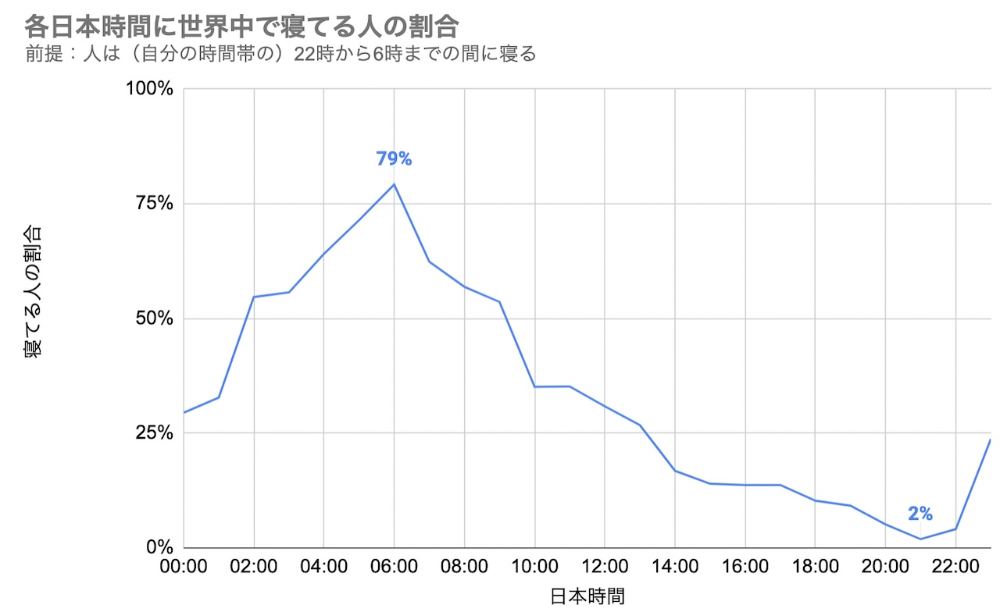
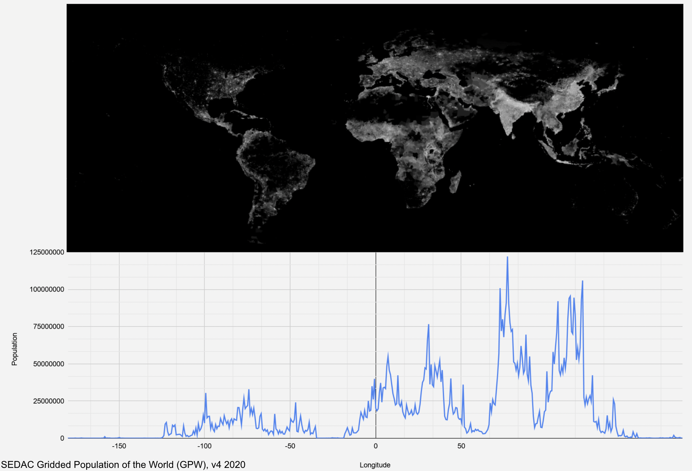

# いま世界で寝ているのは何%？

各日本時間に世界の何割が寝ているか計算するスクリプトです。

tl:dr;

- 日本時間 6 時に世界の 79%が寝ています
- 日本時間 21 時に世界の 2%が寝ています
  （2020/3/11 更新）



もともと[こちらのツイート](https://twitter.com/sobsin/status/1369397843350478852)で問われていた「歴史的に一番人が寝ていた瞬間っていつだったのかな」がとても面白い疑問だと思い、「歴史的に」の部分は飛ばして「日々、一番人が寝ている時間はいつだろう」を計算してみることにしました。

# 方法

「すべての人は（自分の現地時間の）22 時から 6 時の間に寝る」と仮定します。かなりの単純化ですが、大きく傾向の違いが出るほど乱暴ではないと考えています。

まず、[SEDEC の公開している、座標ごとの推定人口データ](https://beta.sedac.ciesin.columbia.edu/data/set/gpw-v4-population-count/data-download)を使い、経度毎の推定人口を算出します。

これを使い、各時間帯の人口を計算します。
次に、ある（日本の）時刻において、各時間帯が寝ているか否かを上記仮定に基づき判定し、寝ている人口をプロットします。

# 結果と考察

上記 t:dr;にあまり追記することはありませんが、少し妥当性について語ります。
日本時間の朝 6 時には世界の 79%が寝ているというのは驚きの結果です。簡単な検算をしてみましょう：

- [Wikipedia によると](https://en.wikipedia.org/wiki/List_of_continents_by_population)、アジア＋アフリカ＋ヨーロッパで全人口の 86%が占められています。
- 日本時間 6 時には、
  - UTC+8（北京とか）が 5 時で寝ています。
  - UTC+1（ヨーロッパの殆ど）が 22 時で寝ています。
- なので、日本時間 6 時にヨーロッパ、アフリカ、アジアの大半は寝ているということになり、79%が寝ているというのは結構妥当っぽいです。

# 実行する

まずコードを用意：

```
git clone https://github.com/kenkawakenkenke/sleeping_population.git
cd sleeping_population
npm install
```

その間に SEDEC のサイトで Gridded Population of the World (GPW), v4 2020 データをダウンロードしてください。メールアドレスの登録などが必要ですが、無料です：
https://beta.sedac.ciesin.columbia.edu/data/set/gpw-v4-population-count/data-download

この中の gpw-v4-population-count_2020.tif を"data"フォルダに置いてください。

最後に、スクリプトを実行：

```
node src/index.js
```

すると、結果が出てきます：

```
 0:00  9:00 4363479286.312379 0.5446038772262918
 1:00 10:00 3148818571.495159 0.3930026224938636
 2:00 11:00 2747465974.7750688 0.3429099863275248
 3:00 12:00 2748184118.2527204 0.3429996174903358
 ...
```

結構衝撃的な結果だったので、ぜひコードをよく読んで追試していただけると助かります。
