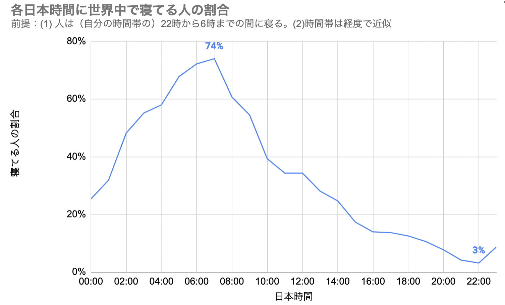

# なにこれ

各日本時間に世界の何割が寝ているか計算するスクリプトです。

tl:dr;

- 日本時間 7 時に世界の 74%が寝ています
- 日本時間 22 時に世界の 3%が寝ています



# 方法

あとでかく。

# 結果

あとでかく。

# 実行する

まずコードを用意：

```
git clone https://github.com/kenkawakenkenke/sleeping_population.git
npm install
```

その間に SEDEC のサイトで Gridded Population of the World (GPW), v4 2020 データをダウンロードしてください：
https://beta.sedac.ciesin.columbia.edu/data/set/gpw-v4-population-count/data-download

この中の gpw-v4-population-count_2020.tif を"data"フォルダに置いてください。

最後に、スクリプトを実行：

```
node src/index.js
```

すると、結果が出てきます：

```
 0:00  9:00 4363479286.312379 0.5446038772262918
 1:00 10:00 3148818571.495159 0.3930026224938636
 2:00 11:00 2747465974.7750688 0.3429099863275248
 3:00 12:00 2748184118.2527204 0.3429996174903358
 ...
```

結構衝撃的な結果だったので、ぜひコードをよく読んで追試していただけると助かります。
